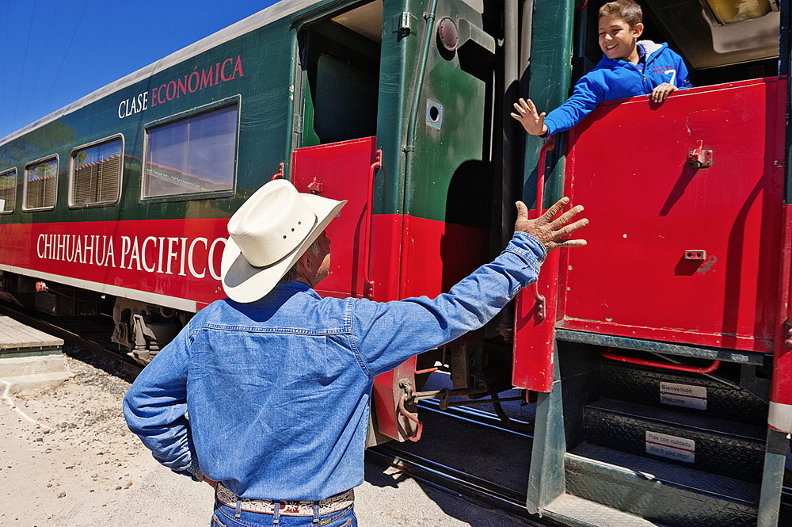

# BIG TRIP: UNKNOWN MEXICO

On September 16th Mexico celebrates its national holiday - Independence Day. On this day, in 1810, a popular uprising began in the country, which turned into a war for independence from Spain. We explored the northern part of the country in search of thrills.

There is Mexico, where tourists are delighted with sunny sombreros, songs of marjacas and gentle waves of the ocean, and local - with relaxed life and abundant soil. And there is another Mexico, with a harsh dry climate and scarce stony land. The editor of "Around the World" went there, to the north, to the state of Chihuahua - to temper the character and look for thrills.

...Here it is, green. He, who poisoned my first dinner on Mexican soil. I stand in the kitchen of Maite Luhan, hostess of Las Guacamayas hotel, and study the poster of The great Chili Poster. It is the green one, jalapeno. My throat is intercepted as it was three days ago. At that late dinner. 

Appetizingly browned on the grill, the provoke pod smiled at me lying on a piece of fried Arrachero steak. I took a bite, not expecting a catch. And at the same moment, my inner world fell to the size of a convulsive lump in my throat. And only Cynthia's contemptuous look seeped out of the outside. Now she is not near, and I can, having swallowed, calmly study the poster with peppers. Jalapeno - sharpness 5.5 on a 10-point scale. Serrano has 7 points. Habanero has all 10 points. Do I have chances in this land of courage, loyalty and hospitality?

*"I take a deep breath and tell myself: calm down.
...Ooh, Chihuahua!" A line from a once popular DJ Bobo song written for a Coca-Cola commercial in Spain suddenly made sense.*

What do our people know about the Mexican state of Chihuahua by default? "Are there chihuahua dogs running around?" or "The Chihuahua that the song is about?". - asked me before the trip. I found out in advance that Chihuahua is the largest, northern and harsh state in Mexico. The Western Sierra Madre, with its treasures in the form of the Copper Canyon and the fast legs of the Taraumara Indians, is also the most industrial and criminal state of Mexico. When I came to Chihuahua, I was asked, "Do you know a song like this - "Oh, Chihuahua!"? It's about us!" No, it does not seem to me so. The carefree rhythm of mambo and coca-color revelations that life can be very simple if you have fun - it's not about Chihuahua. "Roberto, how are you with crime?" - I ask you. Roberto is offended.

The motto on the state coat of arms is: "Courage, loyalty, hospitality."

